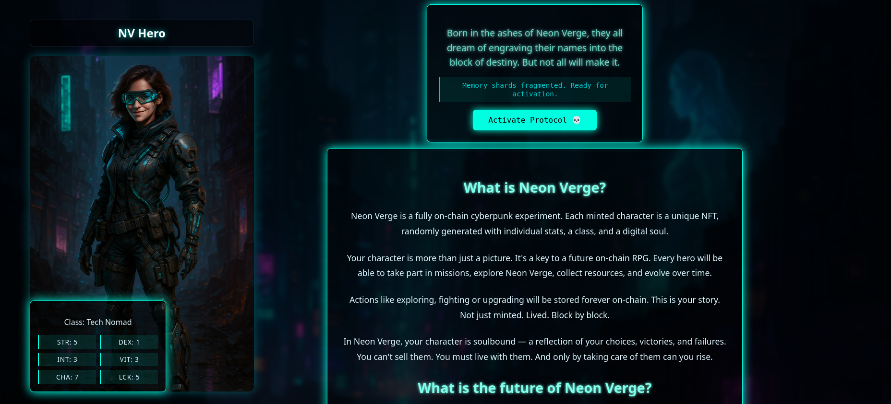
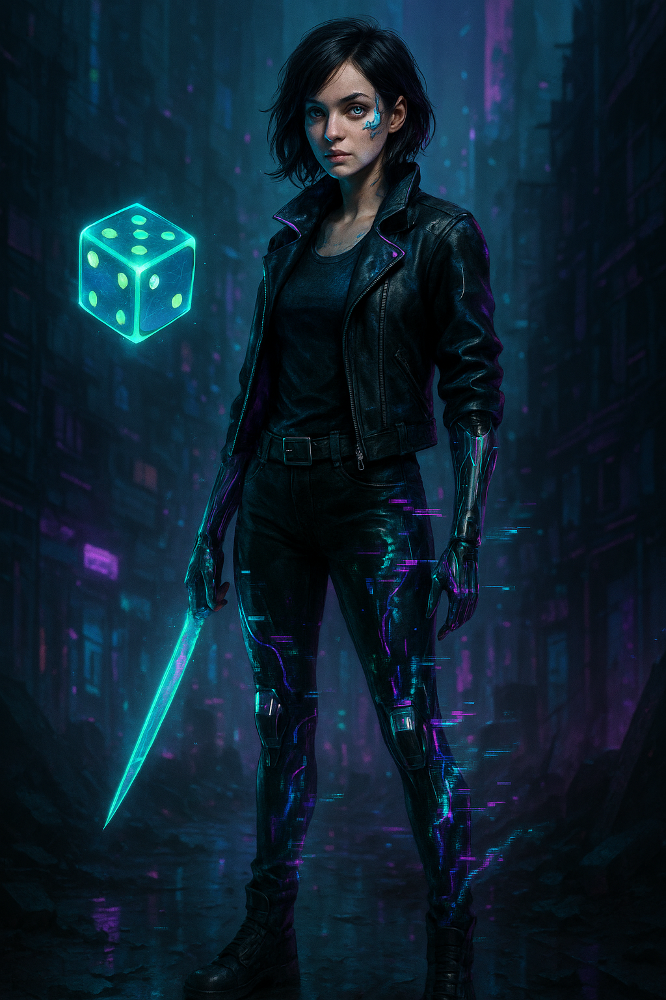
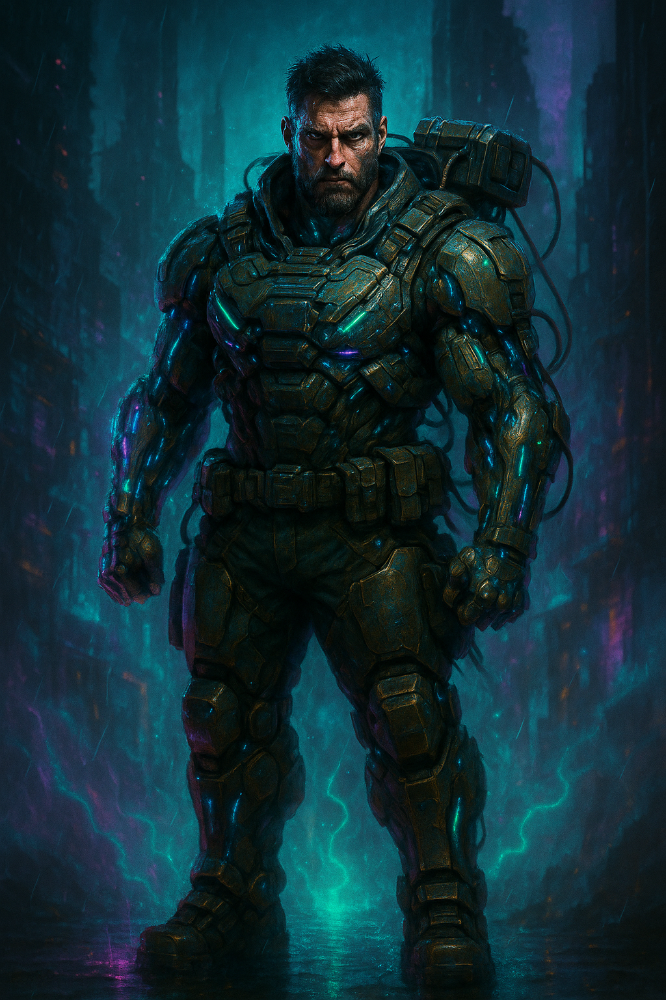
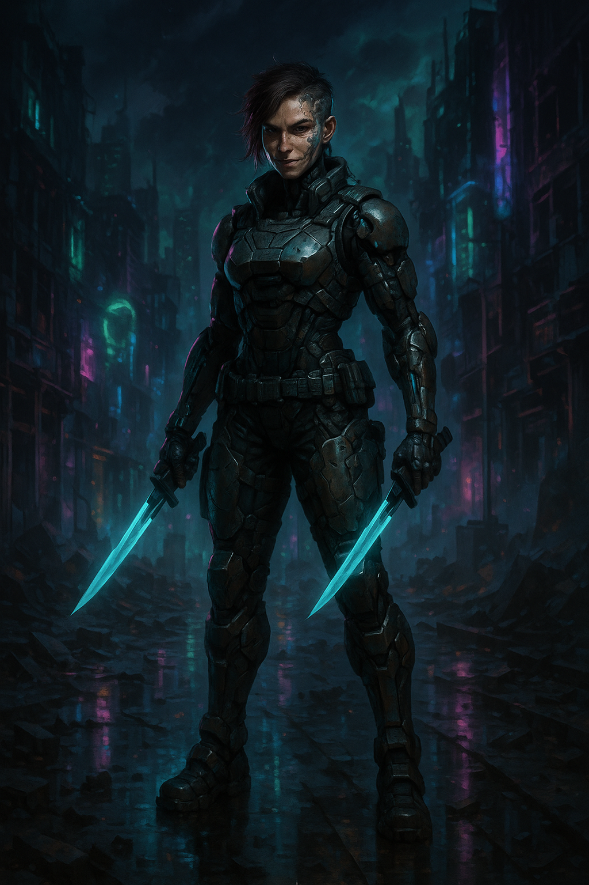
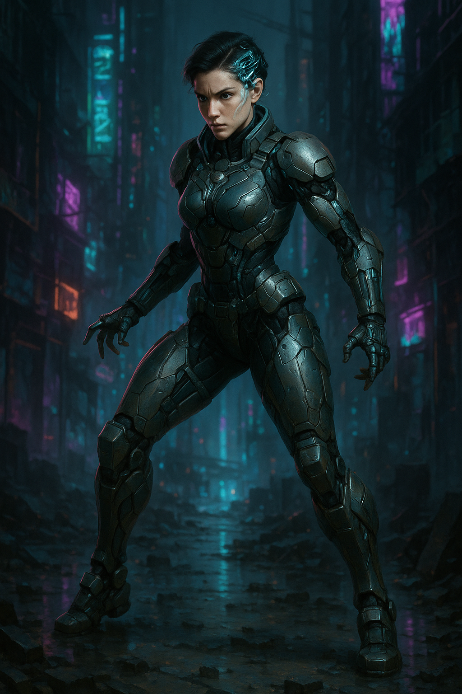
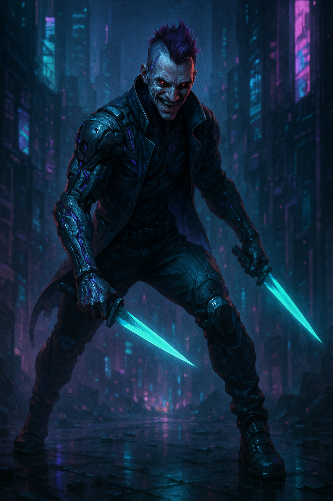

# ⚡ Neon Verge – On-Chain Hero NFT Game

> A cyberpunk-flavored NFT game built entirely on-chain.  
> **Every hero is a contract-native NFT with stats, class, image, and soulbound logic.**  
> No fake metadata. No off-chain smoke. Just Solidity.

---

 <!-- Change path if needed -->

---

## 🧱 Project Summary

Neon Verge is a modular, on-chain role-playing game where each hero is:

- Minted as an ERC-721 NFT
- Assigned **dynamic stats**, **rarity**, and **image ID**
- Managed fully on-chain (class, rarity, transferable status)
- Designed for future **on-chain gameplay** and **event logic**

> The contract **is the source of truth**. Not a database. Not an IPFS hash.

---

## 🛠️ Tech Stack

- Solidity (0.8.x)
- Hardhat
- React + ethers.js
- TailwindCSS
- Designed for L2 deployment

---

## 📦 Project Status

| Component           | Status         | Notes                                 |
|---------------------|----------------|----------------------------------------|
| 🔗 NFT Contract      | ✅ Done         | Dynamic minting, stats, rarity, SB     |
| 🧪 Unit Tests        | ✅ Included     | All core functions tested              |
| 🖼️ React Frontend    | ⚙️ In progress  | Stats display, image rendering         |
| 🎮 On-chain Minigame | 🔜 Coming soon  | Fully modular hero interaction logic   |
| 🌍 Testnet Demo      | 🔜 Coming soon  | Will be deployed on MegaETH or Monade  |

---

## 🧬 Features (Solidity)

- `mintCommonHero()` → One free hero per wallet  
- `mintHero()` → Rarity-based advanced mint  
- `getHeroStatsRaw()` → Direct data access (no metadata hacks)  
- `setSoulbound()` → Transfer control  
- `transferForWhitelistedContract()` → Off-chain bridges with rules  

---

## 🖼️ Example Hero Preview

> Directly pulled from on-chain struct data (no IPFS)

<p align="center">
  
  
  
  
  
</p>

---

## 🔧 Local Setup

```bash
git clone https://github.com/UnblinkingEyeNG/neon-verge-nft.git
cd neon-verge-nft
npm install

# Start local node
npx hardhat node

# Deploy contract
npx hardhat run scripts/deploy.js --network localhost

# Start frontend (if installed)
cd client
npm run dev
```

---

## 🙋‍♂️ Who's Building This?

**Loïc / @UnblinkingEyeNG**  
Solo Web3 builder. Solidity-focused.  
Looking for **freelance contracts**, open to **collaborations** on serious game projects.  
Reach out on X or through the repo.

---

## 📜 License

**Smart Contracts:** [MIT License](./LICENSE) – free to use, modify, and deploy.  

Built and maintained by **Loïc / @UnblinkingEyeNG**

---

## 🧠 Want to Build on Neon Verge?

This project is designed to be modular and expandable.  
If you'd like to build quests, extensions, or new mechanics on top of it — you're welcome.

> 🚫 Full clones or rebrands of the Neon Verge identity are not allowed without written permission.

For collab, licensing, or integration: [DM me on X](https://twitter.com/UnblinkingEyeNG)


